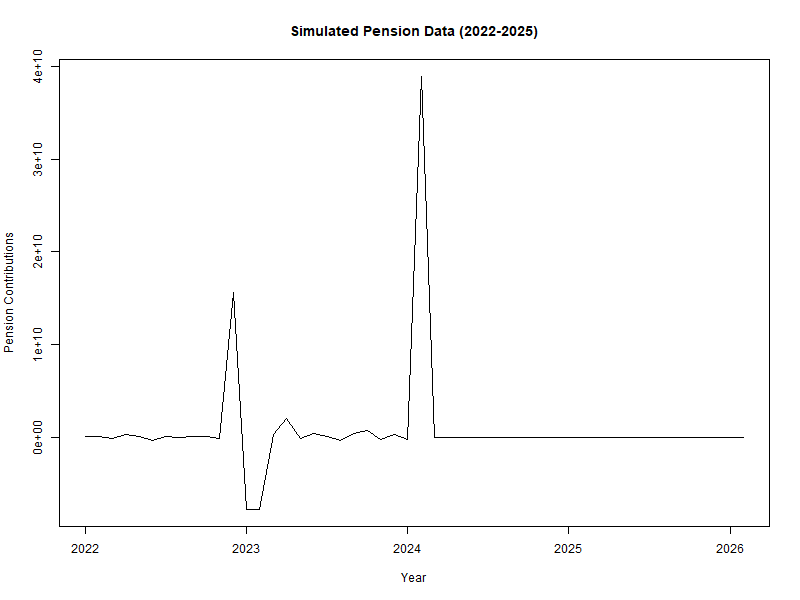
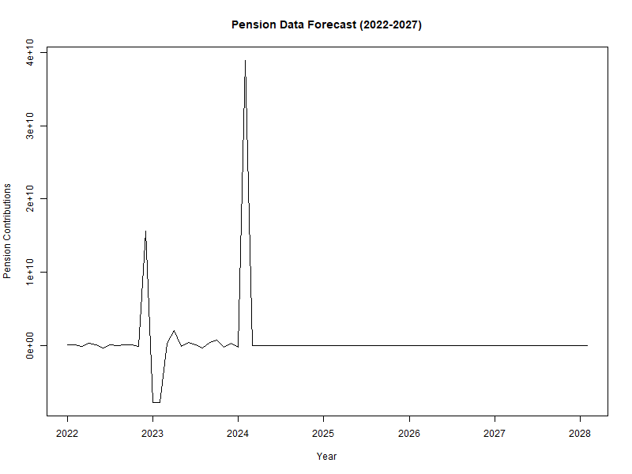
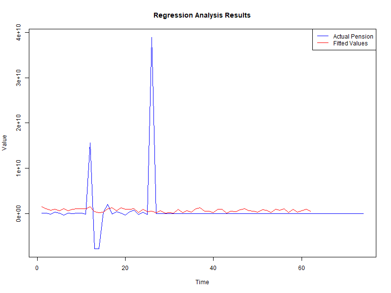
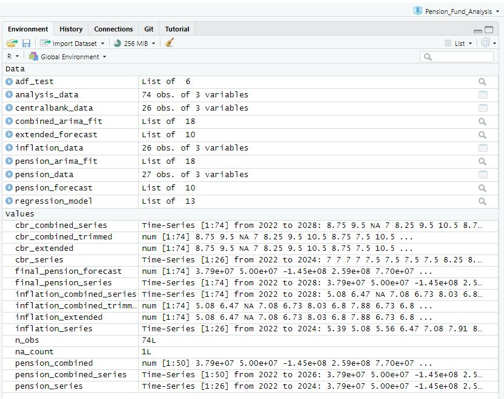

# Pension Fund Analysis Research


This R project aims to model the growth of pension funds in Kenya using the Autoregressive Integrated Moving Average (ARIMA) model and analyze the impact of external factors on this growth. The specific objectives are:

1. **To forecast the growth of pension funds in Kenya using the ARIMA model.**
2. **To analyze the impact of external factors on the growth of pension funds.**

## Solution

### Objective 1: Forecasting Pension Fund Growth

**Steps:**

1. **Data Preparation:**
    - Pension contribution data, inflation rates, and central bank rates for 2022 and 2023 are loaded from Excel files.
    - The pension contribution data is extracted and converted into a time series object.
2. **Simulating Pension Data:**
    - An ARIMA model is fitted to the existing pension contribution data to capture its underlying pattern.
    - The ARIMA model is then used to forecast the pension data for the years 2024 and 2025, extending it to a total of 48 observations.
    - The simulated pension data is plotted to visualize the forecasted growth.

### Objective 2: Analyzing Impact of External Factors

**Steps:**

3. **Fitting Distributions for External Factors:**
    - Central bank rates (CBR) and inflation rates are extracted and converted into time series objects.
    - Distributions are fitted to the CBR and inflation rate data to match the length of the pension data.
4. **Regression Analysis:**
    - The pension data, along with the simulated CBR and inflation rate data, are combined into a data frame.
    - A regression model is constructed with the pension data as the dependent variable and the CBR and inflation rate as independent variables.
    - The regression model is fitted and summarized to analyze the impact of external factors on the growth of pension funds.
    - The regression results are plotted to visualize the relationship between the actual pension contributions and the fitted values.

## Results

- **Simulated Pension Data (2022-2025):**
    - The ARIMA model Simulates Pension Data to 48 observations (2022-2025)
    - 

- **Pension Data Forecast (2022-2027):**
    - The ARIMA model forecasts the growth of pension funds up to 2027, showing an increasing trend over time.
    - 
    - 
- **Regression Analysis Results:**
    - The regression analysis reveals a significant impact of central bank rates and inflation rates on pension contributions.
    - 

## Required Libraries and Packages

```r
# Load necessary libraries
install.packages("readxl")
install.packages("forecast")
install.packages("ggplot2")
install.packages("imputeTS")
install.packages("tseries")

# Load the packages
library(readxl)
library(forecast)
library(ggplot2)
library(imputeTS)
library(tseries)
```

## R Script

```r
# Set working directory to the project folder
setwd("C:/Users/izach/Desktop/izach/R-Projects/Pension_Fund_Analysis")

# Load data from Excel files
pension_data <- read_excel("data/Pension_Contributions.xlsx", skip = 1)  # Skip the first row
inflation_data <- read_excel("data/Inflation_Rates.xlsx",  skip = 1) # Skip the first row
centralbank_data <- read_excel("data/CentralBank _Rates.xlsx", skip = 1) # Skip the first row

# Inspect the data
head(pension_data)
head(inflation_data)
head(centralbank_data)

# Extract and handle missing values in pension data
pension_series <- ts(pension_data$`AMOUNT (KES)`, start = c(2022, 1), frequency = 12)
pension_series <- na_interpolation(pension_series)

# Check for stationarity using Augmented Dickey-Fuller test
adf_test <- adf.test(pension_series)
print(adf_test)

if (adf_test$p.value > 0.05) {
  # If p-value > 0.05, the series is non-stationary, apply differencing
  pension_series <- diff(pension_series)
}

# Step 1: Simulate Pension Data to 48 observations (2022-2025)
# Fit ARIMA model to existing data
pension_arima_fit <- auto.arima(pension_series)

# Forecast additional 24 observations (2 years)
pension_forecast <- forecast(pension_arima_fit, h = 24)

# Combine original and forecasted data
pension_combined <- c(pension_series, pension_forecast$mean)

# Create time series object for combined data
pension_combined_series <- ts(pension_combined, start = c(2022, 1), frequency = 12)

# Save plot to a file
png(filename = "simulated_pension_data_2022_2025.png", width = 800, height = 600)
plot(pension_combined_series, main = "Simulated Pension Data (2022-2025)", ylab = "Pension Contributions", xlab = "Year")
dev.off()

# Step 2: Forecast Pension Data to 2027
combined_arima_fit <- auto.arima(pension_combined_series)
extended_forecast <- forecast(combined_arima_fit, h = 24)
final_pension_forecast <- c(pension_combined_series, extended_forecast$mean)
final_pension_series <- ts(final_pension_forecast, start = c(2022, 1), frequency = 12)

# Save final forecast plot to a file
png(filename = "final_pension_forecast_2022_2027.png", width = 800, height = 600)
plot(final_pension_series, main = "Pension Data Forecast (2022-2027)", ylab = "Pension Contributions", xlab = "Year")
dev.off()

# Step 3: Fit Distribution for CBR and Inflation Data
cbr_series <- ts(centralbank_data$`CENTRAL BANK RATE (%)`, start = c(2022, 1), frequency = 12)
inflation_series <- ts(inflation_data$`12-MONTH INFLATION`, start = c(2022, 1), frequency = 12)

# Extend CBR and Inflation data to match length of Pension data
set.seed(123)
cbr_extended <- sample(cbr_series, length(final_pension_series), replace = TRUE)
inflation_extended <- sample(inflation_series, length(final_pension_series), replace = TRUE)

cbr_combined_series <- ts(c(cbr_series, cbr_extended), start = c(2022, 1), frequency = 12)
inflation_combined_series <- ts(c(inflation_series, inflation_extended), start = c(2022, 1), frequency = 12)


# Ensure all series have the same length
n_obs <- length(final_pension_series)
cbr_combined_trimmed <- cbr_combined_series[1:n_obs]
inflation_combined_trimmed <- inflation_combined_series[1:n_obs]

# Step 4: Regression Analysis
analysis_data <- data.frame(
  Pension = as.numeric(final_pension_series),
  CBR = as.numeric(cbr_combined_trimmed),
  Inflation = as.numeric(inflation_combined_trimmed)
)

# Fit regression model
regression_model <- lm(Pension ~ CBR + Inflation, data = analysis_data)
summary(regression_model)

# Plot the regression results
png(filename = "regression_analysis_results.png", width = 800, height = 600)
plot(analysis_data$Pension, type = "l", col = "blue", xlab = "Time", ylab = "Value", main = "Regression Analysis Results")
lines(fitted(regression_model), col = "red")
legend("topright", legend = c("Actual Pension", "Fitted Values"), col = c("blue", "red"), lty = 1)
dev.off()
```
** Environment Results **
    - 
      
## How to Run

1. Ensure all required libraries are installed and loaded.
2. Set your working directory to the project folder.
3. Load the data files from the `data` directory.
4. Follow the steps in the R script to simulate, forecast, and analyze the pension fund data.
5. View the plots generated to visualize the results.

For any questions or issues, please open an issue in this repository.
